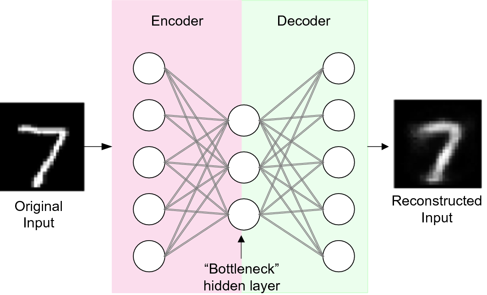
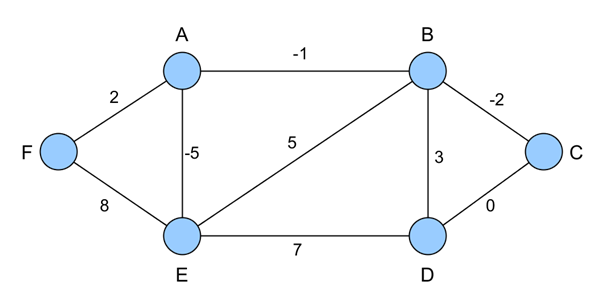
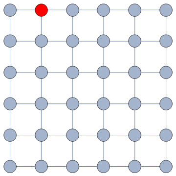
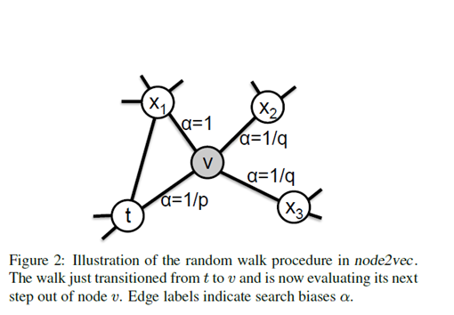
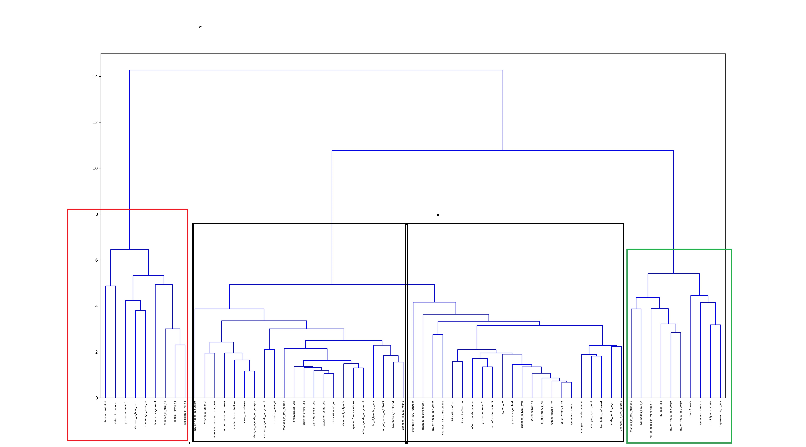
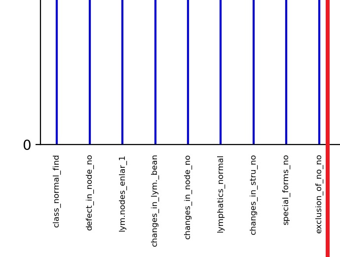
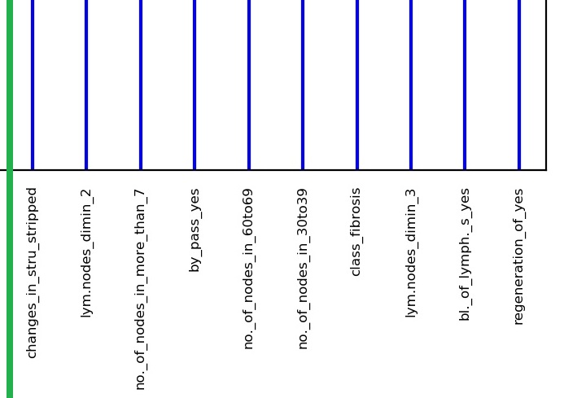
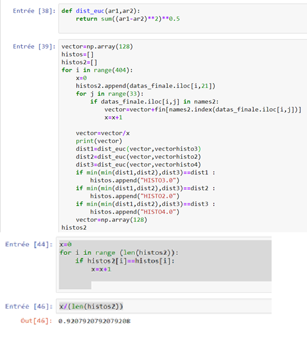

# Portfolio
Welcome to my portfolio, i'm Adil Qarboua a new technologies ethousiast, i have strong interest to the fields of Artificial Intelligence and High Performance Computing.
i have a preference towards low level programming language (C and C++) even if i know some Python and Java.

In the next sections i will present my academic background with emphasis on two particular projects.

I hope that you will find it interesting.
## Academic Background

:point_down: (click to expand) 

  
 Morrocco Education system 
 
I borrowed the following table from <a href =https://www.scholaro.com/pro/Countries/Morocco/Education-System> ScholarPro </a> it resume's the Educational system of Morocco.

The path i followed (the most common path) is 6 years of primary shcool, 3 years of middle school followed by 3 years of secondary school, then i attended a bachelor's degree (4 years precedently 3) followed by a master's degree(2 years).

I will present my University degree's(Bachelor and Master) with more details after the table.

<table><colgroup><col style="width:10px" /><col style="width:85px" /><col style="width:240px" /><col style="width:70px" /><col style="width:70px" /><col style="width:70px" /><col style="width:335px" /></colgroup><tbody>
  <tr class="k-master-row"><td style="background-color: #9999CC"></td><td>Education</td><td>School Level</td><td style="text-align:center;">Grades</td><td style="text-align:center;">Age</td><td style="text-align:center;">years</td><td>Notes </td></tr><tr class="k-alt k-master-row"><td style="background-color: #7ABDFF"></td></tr>
  
  
  
  
  <tr class="k-master-row"><td style="background-color: #9999CC"></td><td>Primary</td><td>Primary School</td><td style="text-align:center;">1–6</td><td style="text-align:center;">6–12</td><td style="text-align:center;">6</td><td>Primary School education is compulsory </td></tr><tr class="k-alt k-master-row"><td style="background-color: #7ABDFF"></td><td>Middle</td><td>Basic Education (Cycle  coll&#233;gial)</td><td style="text-align:center;">7–9</td><td style="text-align:center;">12–15</td><td style="text-align:center;">3</td><td>Certificate/diploma awarded: Certificat d&#39;Enseignement secondaire
</td></tr>
 
  
  
 <tr class="k-master-row"><td style="background-color: #95E495"></td><td>Secondary</td><td>General Secondary (Cycle  qualificant)</td><td style="text-align:center;">10–12</td><td style="text-align:center;">15–18</td><td style="text-align:center;">3</td><td>Certificate/diploma awarded: Baccalaur&#233;at</td></tr><tr class="k-alt k-master-row"><td style="background-color: #95E495"></td><td>Secondary</td><td>Technical Secondary</td><td style="text-align:center;"></td><td style="text-align:center;">15–18</td><td style="text-align:center;">3</td><td>Certificate/diploma awarded: Baccalaur&#233;at Technique</td></tr><tr class="k-master-row"><td style="background-color: #FFCC99"></td><td>Post-secondary</td><td>General University Diploma</td><td style="text-align:center;"></td><td style="text-align:center;"></td><td style="text-align:center;">2</td><td>Preparatory phase: Dipl&#244;me ď&#201;tudes Universitaires G&#233;n&#233;rales</td></tr><tr class="k-alt k-master-row"><td style="background-color: #FFCC99"></td><td>Vocational</td><td>Technical</td><td style="text-align:center;"></td><td style="text-align:center;">18–20</td><td style="text-align:center;">2</td><td>Certificate/diploma awarded: Brevet de Technicien sup&#233;rieur</td></tr><tr class="k-master-row"><td style="background-color: #FF7A7A"></td><td>Tertiary</td><td>Bachelor&#39;s</td><td style="text-align:center;"></td><td style="text-align:center;"></td><td style="text-align:center;">4</td><td>Licence</td></tr><tr class="k-alt k-master-row"><td style="background-color: #FF7A7A"></td><td>Tertiary</td><td>Master&#39;s</td><td style="text-align:center;"></td><td style="text-align:center;"></td><td style="text-align:center;">1–3</td><td>Leads to the award of the Licence / Ma&#238;trise /Dipl&#244;me
(4 to 5 yeas total including preparatory phase)
</td></tr><tr class="k-master-row"><td style="background-color: #FF7A7A"></td><td>Tertiary</td><td>Doctorate</td><td style="text-align:center;"></td><td style="text-align:center;"></td><td style="text-align:center;">2–7</td><td>Certificate/diploma awarded:Dipl&#244;me d’Etudes Sup&#233;rieurs(DES), 
Dipl&#244;me d’Etudes Sup&#233;rieurs Approfondies(DESA)
(two to three years in length)
Students wishing to study for the Doctorat must first complete the DES(S/A). Doctoral studies require at least two years of research beyond the DES and the writing and defense of a dissertation. The Doctorat en M&#233;decine and Doctorat en M&#233;decine Dentaire require a baccalaur&#233;at from the science track for entry and studies last seven and five years respectively.</td></tr></tbody></table>

Between September 2014 and July 2018 pursued my Bachelor's Degree of Mathematical and Computer science (the local name is "Licence Mathématiques et Informatique" at the University Mohammed V Souissi (Rabat),
you may find more informations about it here <a href=http://www.fsr.ac.ma/content/sciences-math%C3%A9matiques-et-informatique> Official Faculty website </a>).

The content put focus on Mathematics basics during the first year (Calculus,Algebra, Linear Algebra, Arithmetics etc...),with some course on physics (Electrostatics and Thermodynamics) and an introduction to Algorithmic and Informatics, then you may specialize into Applied mathematics or computing science, i followed the computing science path.

The two following years emphasis on the specialization choosen by the students with courses on programmation (Imperative programming under c (two courses), OOP (JAVA) Conception(UML), SQL Databases and relational algebra, Numerical Analysis, Operating systems(two courses), Computer architecture, Web developpement (two courses HTML CSS JS, PHP), Computer networks (3 courses), Data structures, Probability and Statistics,Compilation, Electronics, Magnetostatics, Operations Research(Optimisation, Simplex algorithm, Shortesth path and maximum flow problem), GUI(Java(swing/AWT)). 

Then From September 2018 to November 2020 (The presentation of the graduation project was delayed due to the coronavirus crisis, Moroccan authorities imposed a strict 3 months
quarantine) I pursued a Master' Degree at the same University on Intelligent Processing Systems wich focus on Artifical Intelligence and Data Science with courses on Data Mining, Machine Learning, Deep Learning, Computational and Heuristics, Artificial Intelligence, Big Data, Cloud Computing, Business Intelligence, Constraint satisfaction problems etc... .(more info: <a href=http://www.fsr.ac.ma/content/traitement-intelligent-des-systemes> Master Flyer </a>)).

## Precedent work
### C/c++

  
 Hypergraph Embedding for Clustering

  
  #### Introduction
  
  _Graph embedding_ is a method who tries to **transform graph vertices to vectors** representing theese vertices.
  The vectors should capture some of the caracteristics of the vertices mainly their **proximity**.
  Two vertices who are neighbors should be embedded to two vectors having a low distance measure (Euclidian Distance for example) between them.
  
  #### Application  
  Graph embedding have a large application panel on the fields of :
 
  * Biomedical and BioInformatic
  * Knowledge Graphs
  * Association Rule Extraction
  * NLP (Word2vec) 
  * **Features encoding** 
  We will focus on features encoding. In the next section i will present the principle of Word2Vec who is widely used on NLP and who is
  mainly based on graph embedding.
  
  #### Word2vec and auto-encoders
  **Word2vec** is an algorithm who process a text corpus and who transform each word into a vector based on the training of a special
  type of **auto-encoders**.
  
  A classic **auto-encoder** is a neural network where the labels (the output desired vectors) are the input data.
  The goal of an **auto-encoder** is to capture the input vectors on the weights at the middle hidden layer.
  It's used for compression purposes by feeding a neural network where this layers contain less nodes than the original vectors dimension.
  

  
   
  

  The special type of auto-encoders used by Word2vec is called a **skip-gram model** where the desired outputs are the words who appears in the same
  context.
  
  Word2Vec work by assuming a relatively coherent hypothesis wich is **two words who appears on the same context may have the same signification**.
  
  Let's take a look on a funny equation involving words instead of numbers.
  
  Paris - France + England = London.
  
  Even if it's not common it's seems correct we can interpret it as if you retrieve the signification of  the word France from the word Paris you will end up with 
  Capital city by adding england to it you end up in London.
  
  In reality the text corpus this particular **skip gram model** was trained on is a corpus who describe different statistic metrics on cities. Paris and London appears often on the same context as (The highest population density, The highest GPD per capita etc...).
  The fact that words where transformed into vectors allow us to do the - and + operations and the equality (the = operator) is in reality the word represented by the vector with the lowest euclidian distance to the current result of the equation.
  
  How can a **skip gram model** capture this proximity regarding to the context?
  
  Take a look at the next figure.
  

  
   
  

  
  The skip garm model will train an auto encoder as if the most common desired output for each word is the most common words surrounding it on a sentence.
  Two words will be similar (have a low euclidian distance between them on the vectorial space) if they appear often on the same context.
  
  The **auto encoder** duty will be to encode sufficiently well the input vector on the most inner hidden layer of it's encoder part.
  
  So if you retrieve the weights of this layer they should somehow encode the features in a way that will allow a discrimination,
  these weight will then represent the features on the vectorial space after the training.
  
  #### Clustering and similarity
  During this section i will briefly present the principles behind the clustering algorithms present on the figure Clustering algorithm and similarity.
  Then i will present **Hashian and Liu** Hypergraphs modelisation proposal for capturing similarity between features of a qualitatif dataset based on frequency.
  
  ##### AHC
  The **AHC** algorithm can be resumed as:
  
  1) Calculate the dissimarity measure between the elements of a dataset
  2) Agregate the 2 elements with the lowest measure of dissimilarity into a cluster.
  3) Calculate the dissimilarity between the newly formed cluster and the rest of the elements given an agglomeration criterion.
  4) repeat 2) and 3) until the formation of a final global cluster
  The final result will be a binary clustering tree called a dendrogram, the final step should be cutting the dendrogram according to the number of clusters desired or 
  a statistical criterion based on entropy
  
  ##### Partitioning methods (K-means and variants)
  We assume that we know how many clusters must be created, the algorithm can be described as:
  1) Start by initializing K centers randomly.
  2) Assign each element to the closest center.
  3) Calculate the new centers for each cluster.
  4) repeat the steps 2 and 3 until no element moves from a cluster to another.
  
  A variant consist of calculating the new center after the assignement of each element, it may converge faster but the result depends on the order in wich the elements
  are introduced.
  
  The centers may be:
  * A fictive point representing the simple calculation of the average. (**K-means**)
  * The element closest to the average. (**K-medoid**)
  * The median point. (**K-median**)
  * The mode.(**K-mode**, useful for qualitative dataset where the average calculation is impracticable).
   
   ##### Density Based methods (DB-SCAN).
   DB-SCAN introduce two parameters **MinPts** and **&epsilon;** .
   * **&epsilon;** refer to the maximal distance between two elements under which they are considered as **neighbors**.
   * **Minpts** is the minimal number of neighbors that an element should have to be considered as a **kernel**.
   It introduce also the following definitions:
   
   * An element X is **directly d-reachable** from Y if it's on the neighborhood of Y and Y is a kernel.
   
   * An element X **is d-reachable**  from Y if a list of element (x1,x2,...xn) exist with:
   
     x1=Y, xn=X and for each i>0: xi is directly d-reachable from xi-1. 
   
   * Two elements X and Y are **d-connected**if an element Z exist from wich X and Y are d-reachable.
   
   The algorithm can be described as:
   
   for each element x of the dataset.
   
   if (x is a kernel or x is not in a cluster ):
   
   **construct_cluster**(x).
  
  The call construct_cluster will consider x as a cluster and add it's neighbors to the cluster.
  if a neighbor is a kernel each element d-connected to it will be added to the cluster.
  
  ##### Similarity
  
  Each one of the precedently presented algorithms rely on a dissimilarity measure (generally the euclidian distance).
  
  However for qualitative datasets this calculation is impracticable, feature encoding is a good way of handling this problem.
  
  By embedding the features of a qualitative dataset to a low dimensional space we can apply this calculation provided that those vector 
  capture the similarity.
  
  #### Hashian and Liu modélisation:
  
  A graph (sometimes called undirected graph) is a pair G = (V, E), where V is a set whose elements are called vertices (singular: vertex), and E is a set of paired vertices, whose elements are called edges.
  
  
  A weighted graph is a graph in which weights are assigned to each edge. Such weights might represent for example costs, lengths or capacities, depending on the problem at hand.
  
  

  
   
  

  An hypergraph is a graph generalisation where Edges are tuples who can link more than 2 vertices.
  
  On the paper **A Hypergraph-based Method for Discovering Semantically Associated Itemsets** [[1]](#1), the authors propose a modelisation of a qualitatif dataset as an hypergraph 
  to overcome the limitation of **a-priori** algorithm when it comes to undirect links.
  
  They capture **items as vertices** of an hypergraph, **itemsets as Hyper Edges** and co-occurence frequency as weights. 
  
  Then with some advanced calculcation they define their own proximity measure based on the **Combinatory Hypergraph Laplacien**.
  
  I used this modelisation with graph embedding algorithms DeepWalk and Node2Vec to encode categorical features of a dataset so that the embedded resulting  feature keeps the proximity based on frequency captured by the hypergraph.
  
  Then I used the embedded features for clustering and classification tasks.
  
  .
#### DeepWalk, Node2Vec and Random Walks
  During this section i will present the way i implemented Node2vec and Deep Walk for hypergraphs embedding purposes.
  
  A **random walk** on a graph is a process that begins at some vertex, and at each time step moves to another vertex, it's **length** (L) is the number of vertices visited.
  
  
  

  
   
  

  
  
  When the graph is weighted, **it moves to a neighbor with probability proportional to the weight of the corresponding edge**.
  It result in the **walk** of visited vertices, or the sequence of length L of visited vertices.
  
  
  I implemented Deep Walk [[2]](#2) by feeding to an auto encoder a dataset generated with a High Number of random walks starting from each vertices.
  
  On the generated Dataset each vertex has as a desired output the results of the random walks started from it.
  
  Node2vec[[3]](#3) is a variant of Deep Walk who overcome the rigidity of Deep Walk by introducing two parameters who will alter the strategy of neighbor searching during the random walk who's fixed by the weights during Deep Walk. the first parameter p controls the likelihood of immediately revisiting a vertex in the walk, setting it to a high value decrease the probability of revisting this vertex. Parameter q allows the search to differentiate between **inward** and **outward** vertices, if a vertex is linked to the vertex you immediately left it will be untouched by the q parameter(inward vertex), outward vertices will be favored if q < 1 and if q is set to a high value, the likelihood of visiting such vertices will decrease. 
  
  

  
   
  

  
  
  #### Results
  
  
  I will present the result on a real datasets of patients diagnosed with lymph cancer where I try to identify the common traits of these patients.
  
  This dataset has patient with analysis results on **lymph nodes** who are great indicators of cancer presence.
  
  You can find the dataset here [Lymphography dataset](https://archive.ics.uci.edu/ml/datasets/Lymphography) 
  
  This dataset have 4 diagnosis (normal_find, malign lymph , metastasis and fibrosis).
  
  After the application of Hashian and Liu modelisation and DeepWalk i applied AHC algorithm (SKlearn) to the embedded vectors with the following result:
  
  
  

  
   
  

  
  let's zoom ont the red and green clusters:
  
  
  

  
   
  

  
  

  
   
  

  On the normal find class we recognize the most reassuring analysis results, with lymph node without any change in structure or form, no defects and without a proliferation.
  
  On another hand the fibrosis class has more alarming symptoms as a proliferation of nodes, changes in structure etc... .
  
  The algorithm joined the two other classes metastasis and malign lymph before the ideal dendrogramm cutting point, you can find on the repository the whole dendrogram if you want to check them.
  
  I also applied this to two other datasets, another medical dataset from Morocco Pasteur institute who's about laro-pharynx cancer and an alibaba dataset about customers incentives (such as promotion tickets, and distance to the nearest store), however I'm not sure if i can publish these dataset's given that they are not open source.
  
  The resulsts were similar, I also applied a separation of the dataset to test train and validation, and i tested the precision of the results by averaging the features and comparing them to the nearest vector (who represent a class), wich resulted on a 92% precision on the Moroccan dataset and the alibaba dataset.
  
   
  
  Here Histo_3, Histo_2, and Histo_4 represent the classes as encoded vectors.
  
  The loops iterate over the dataset (404 patient with 33 features), i sum on the variable vector (a 128 numpy array) the encoded features of the patient, then i divide byt the number of feature to get the avg point, and i add to histo2 the label corresponding to the closest class.
  
  Then i compare these labels to the real labels (the vector histos contain the true labels).

  ## References
<a id="1">[1]</a> 
Hashian , Liu (2011). 
A Hypergraph-based Method for Discovering Semantically Associated Itemsets. 
IEEE 11th International Conference on Data Mining.

<a id="2">[2]</a> 
Perrozi, Al–Rfou, Skiena (2014). 
DeepWalk: Online Learning of Social RepresentationsIEEE 11th International Conference on Data Mining.
ACMProceedings of the 20th ACM SIGKDD international conference on Knowledge discovery and data mining p. 701–710 .

<a id="3">[3]</a> 
Aditya, Grover (2016). 
node2vec: Scalable Feature Learning for Networks. 
ACM SIGKDD International Conference on Knowledge Discovery and Data Mining (KDD), 2016.

  
